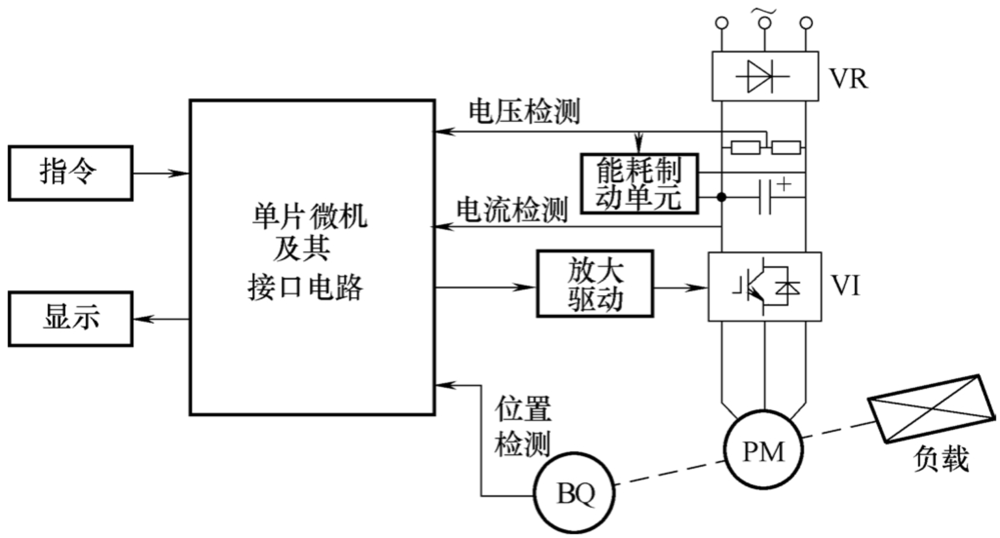

# 永磁无刷直流电动机
Author & Note ：影风远sinkfarli

Create Date ：2022.6.6

## Content
- [Content](#content)
- [永磁无刷直流电动机传动系统原理图](#永磁无刷直流电动机传动系统原理图)

## 永磁无刷直流电动机传动系统原理图
PM为永磁无刷直流电动机本体，BQ为电动机转子位置检测传感器，安装在电动机转轴上。

VR为不控整流桥、VI为逆变桥，构成AC-DC AC变频器。

单片微机驱动VI逆变桥，控制永磁无刷直流电动机，检测系统电压、电流和电动机转子的位置。
